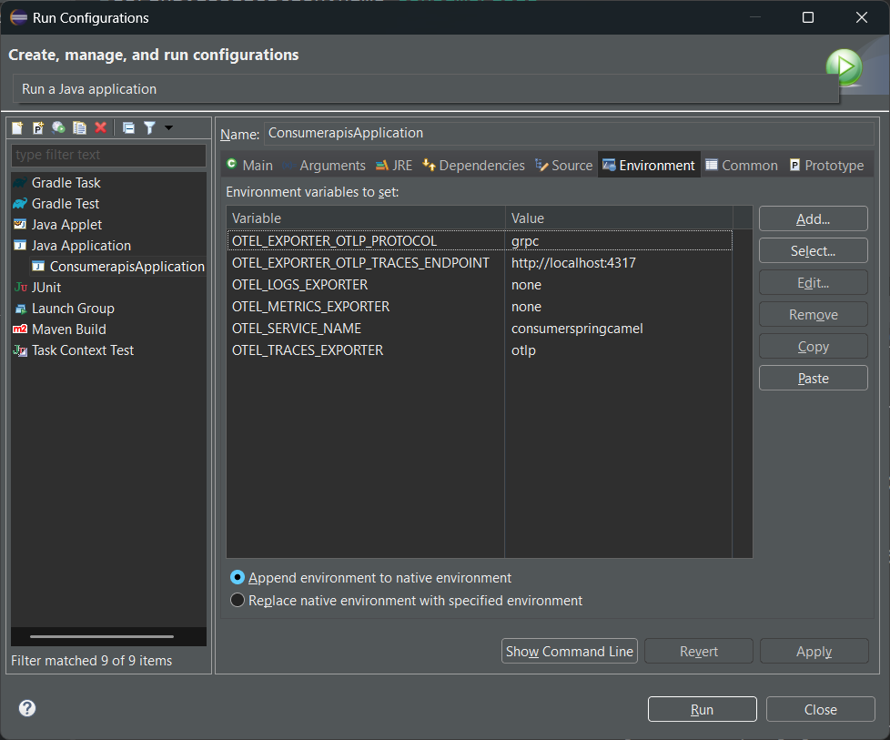
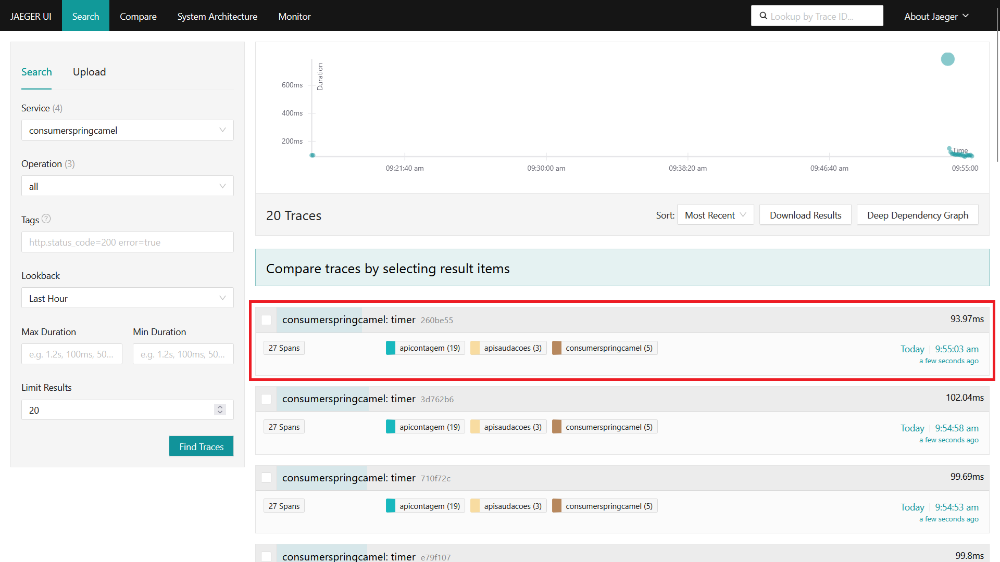
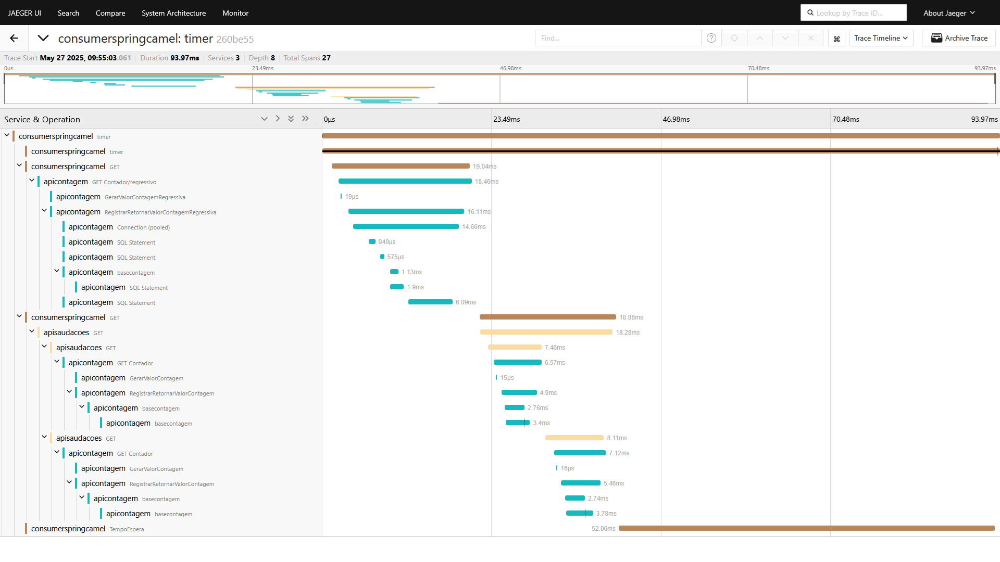

# java-spring-camel-otel-jaeger-postgres-mysql_consumoapis
Exemplo de aplicação criada com Java + Spring + Apache Camel e utilizando Distributed Tracing com Jaeger + OpenTelemetry (configurando porta do Collector) e consumindo APIs REST (uma destas depende de bases PostgreSQL + MySQL). Inclui o uso de Docker Compose para a subida de ambiente que faz uso do projeto Jaeger e do OpenTelemetry Collector.

APIs REST utilizadas por este projeto:
- [**Contagem de acessos (.NET 9 + ASP.NET Core)**](https://github.com/renatogroffe/aspnetcore9-otel-jaeger-postgres-mysql_apicontagem)
- [**Saudações (Node.js)**](https://github.com/renatogroffe/nodejs-otel-jaeger_apisaudacoes)

Agents Java do OpenTelemetry: **https://github.com/open-telemetry/opentelemetry-java-instrumentation/releases**

Variáveis de ambiente a serem configuradas para uso de tracing distribuído com Jaeger:

| Variável                          | Valor                   |
|-----------------------------------|-------------------------|
| OTEL_EXPORTER_OTLP_PROTOCOL       | grpc                    |
| OTEL_EXPORTER_OTLP_TRACES_ENDPOINT| http://localhost:4317   |
| OTEL_LOGS_EXPORTER                | none                    |
| OTEL_METRICS_EXPORTER             | none                    |
| OTEL_SERVICE_NAME                 | consumerspringcamel     |
| OTEL_TRACES_EXPORTER              | otlp                    |

Essas variáveis podem ser configuradas no Eclipse IDE através do menu **Run > Run Configurations... > Environment**:



Já o Agent Java do OpenTelemetry foi configurado em **Run > Run Configurations... > Arguments > VM arguments**:


Para os tests na minha máquina utilizei o valor:

```
-javaagent:D:/Java/opentelemetry/opentelemetry-javaagent.jar
```

Traces gerados durante testes no dashboard do Jaeger:



Exemplo de trace demonstrando uma interação entre as 3 aplicações aqui mencionadas:

